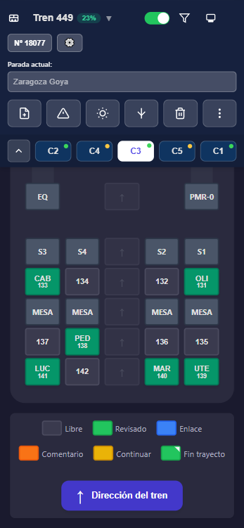
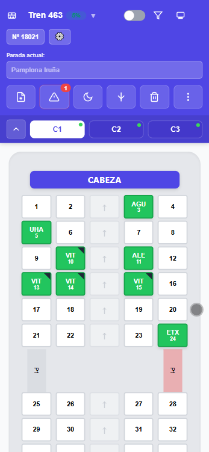
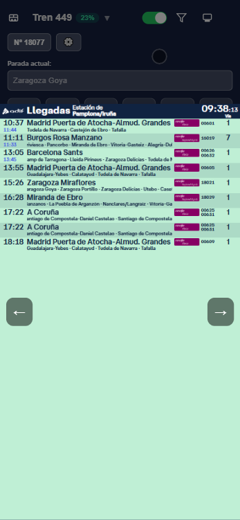
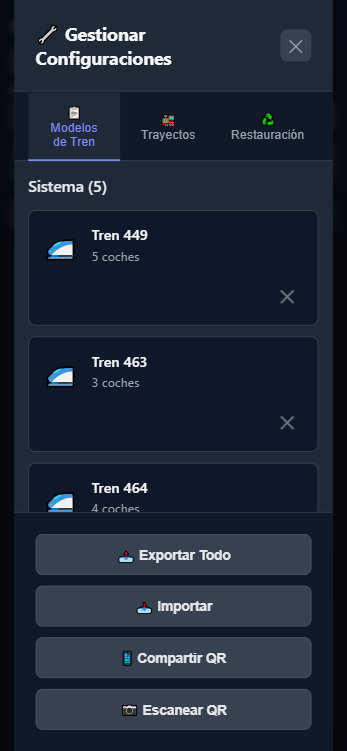
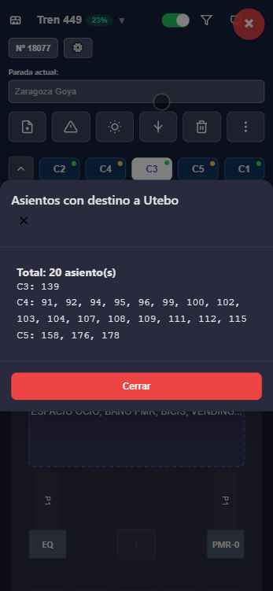
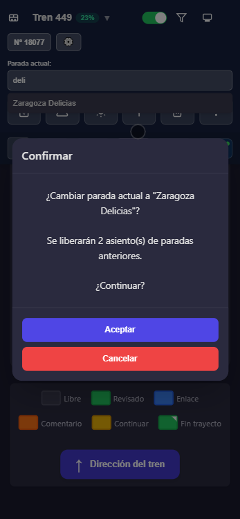
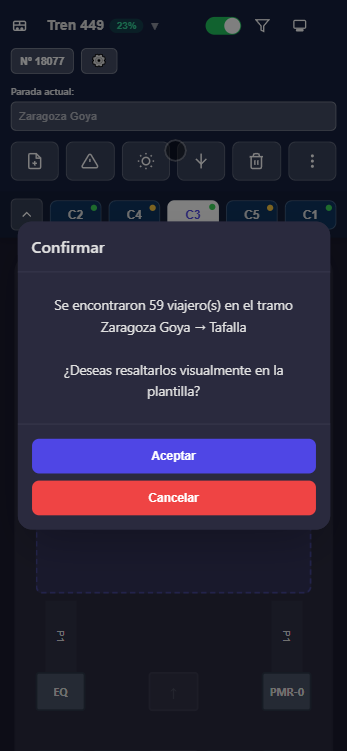
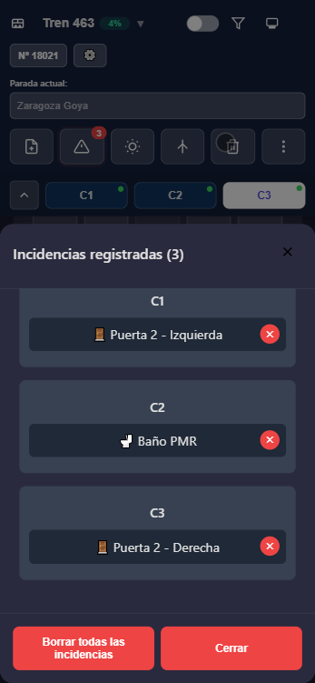
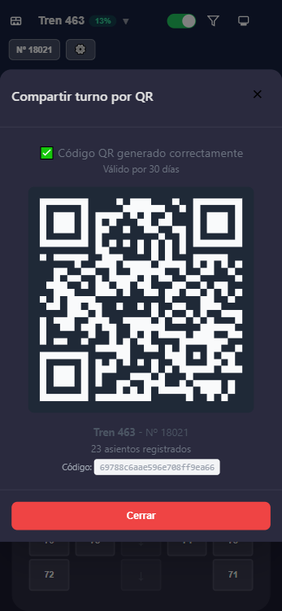

# 🚆 Navirea

**Navirea** es una aplicación web progresiva (PWA) diseñada para interventores de **Cercanías** y **Media Distancia**, que permite gestionar la ocupación del tren, el seguimiento del recorrido y las incidencias del servicio de forma clara, rápida y visual.


---

## ✨ Características principales

- 🚆 **Modelos de tren reales**: Representación precisa de series 463, 464, 465, 470, 449 con sus disposiciones de asientos, PMR, mesas y espacios.
- 🔖 **Unidades 470 guardadas**: Guarda la combinación de variantes de cada unidad física (470.157, 470.235…) y cárgala en un toque para futuras sesiones.
- ⚙️ **Configuraciones personalizadas**: Crea y gestiona tus propios modelos de trenes y trayectos.
- 🎯 **Gestión táctil de asientos**: Marca ocupación, destinos, enlaces y comentarios con gestos intuitivos.
- ⚡ **Copiado rápido**: Asigna la misma información a múltiples asientos con un solo toque.
- 🔎 **Filtros avanzados**: Por parada, tramo, asiento, enlaces o comentarios.
- 📍 **Parada actual inteligente**: Libera automáticamente a los viajeros al llegar a su destino.
- ⚠️ **Gestión de incidencias**: Registra fallos de WC, puertas, megafonía, PMR y equipos.
- 📲 **Compartir turno**: Exporta el estado completo por QR o JSON para el relevo.
- 🌙 **Modo nocturno**: Reduce brillo y contraste para trabajar en condiciones de poca luz.
- 🔄 **Backup automático**: Guarda automáticamente el último estado.
- 📊 **Pantallas de estaciones**: Consulta horarios y conexiones en tiempo real.
- 📘 **Manual técnico integrado**: Acceso al Manual Técnico Ferroviario para resolver incidencias.

---

## 📸 Capturas de pantalla

<table>
  <tr>
    <td width="33%" align="center">
      
      <p><strong>Vista principal del tren</strong></p>
      <p><em>Vista principal de la aplicación mostrando el tren 449 con 5 coches. Se puede ver la disposición de asientos con códigos de colores para identificar el estado de ocupación, destinos asignados y espacios especiales (PMR, mesas, etc.)</em></p>
    </td>
    <td width="33%" align="center">
      
      <p><strong>Vista detallada de un coche</strong></p>
      <p><em>Vista ampliada de un coche individual (Tren 463) mostrando la distribución detallada de asientos con su numeración y estados de ocupación. Los asientos marcados en verde muestran las estaciones de destino de los viajeros (UHA, VIT, ALE, ETX, etc.)</em></p>
    </td>
    <td width="33%" align="center">
      
      <p><strong>Pantalla de horarios de estación</strong></p>
      <p><em>Panel de información de llegadas de la estación mostrando horarios en tiempo real de los trenes, destinos, y estado de los servicios. Útil para consultar conexiones y planificar el servicio</em></p>
    </td>
  </tr>
  <tr>
    <td width="33%" align="center">
      
      <p><strong>Gestor de configuraciones</strong></p>
      <p><em>Interfaz de gestión de configuraciones donde se pueden crear, editar y eliminar modelos de tren personalizados. Incluye opciones para exportar, importar y compartir configuraciones mediante QR</em></p>
    </td>
    <td width="33%" align="center">
      
      <p><strong>Filtro de asientos por destino</strong></p>
      <p><em>Diálogo de filtrado mostrando todos los asientos con destino a Utebo (20 asientos). Permite identificar rápidamente qué viajeros bajan en una parada específica</em></p>
    </td>
    <td width="33%" align="center">
      
      <p><strong>Confirmación de cambio de parada</strong></p>
      <p><em>Diálogo de confirmación al cambiar la parada actual a "Zaragoza Delicias". El sistema notifica cuántos viajeros se liberarán automáticamente al confirmar el cambio</em></p>
    </td>
  </tr>
  <tr>
    <td width="33%" align="center">
      
      <p><strong>Resaltado de tramo</strong></p>
      <p><em>Función de resaltado de tramo que permite visualizar rápidamente los 59 viajeros que están en el trayecto entre Zaragoza Goya y Tafalla, facilitando el control de ocupación por sectores</em></p>
    </td>
    <td width="33%" align="center">
      
      <p><strong>Panel de incidencias</strong></p>
      <p><em>Registro de incidencias del servicio mostrando fallos activos en el tren. En este ejemplo se visualizan 3 incidencias: puerta izquierda del C1, baño PMR del C2 y puerta derecha del C3</em></p>
    </td>
    <td width="33%" align="center">
      
      <p><strong>Compartir turno por QR</strong></p>
      <p><em>Sistema de generación de código QR para compartir el estado completo del tren con otro interventor. El código incluye información del modelo, asientos ocupados y destinos, válido por 30 días</em></p>
    </td>
  </tr>
</table>

---

## 🎯 Público objetivo

Esta aplicación está pensada específicamente para **interventores de**:

- ✅ **Cercanías** (servicios de corta distancia)
- ✅ **Media Distancia** (servicios regionales)

---

## 🚀 Instalación

Navirea es una **Progressive Web App (PWA)**, lo que significa que funciona directamente desde el navegador y puede instalarse como una aplicación nativa.

### Opción 1: Usar desde el navegador

1. Abre el archivo `index.html` en tu navegador web.
2. La aplicación funcionará inmediatamente sin instalación.

### Opción 2: Instalar como PWA

1. Abre la aplicación en Chrome, Edge o Safari.
2. En el menú del navegador, selecciona **"Instalar Navirea"** o **"Añadir a pantalla de inicio"**.
3. La aplicación se instalará y podrás abrirla como cualquier otra app.

### Requisitos

- Navegador moderno con soporte para JavaScript ES6+
- Conexión a internet (solo para pantallas de estaciones y manual técnico)
- Almacenamiento local habilitado (localStorage)

---

## 📖 Guía de uso rápida

### 1️⃣ Selecciona el modelo de tren

- Toca el nombre del tren en la parte superior.
- Selecciona el modelo correspondiente (463, 464, 465, 470, 449 o uno personalizado).
- Introduce el número de venta del tren.

### 2️⃣ Gestiona los asientos

- **Toca un asiento libre** → Introduce la parada de bajada → Guarda.
- **Mantén pulsado un asiento libre** → Asigna la última parada automáticamente.
- **Toca un asiento ocupado** → Modifica destino, añade enlace o comentario.
- **Activa el copiado rápido** → Marca el primer asiento → Los siguientes copiarán la misma información.

### 3️⃣ Establece la parada actual

- Introduce la parada actual del tren.
- Navirea liberará automáticamente los asientos de viajeros que bajan en esa parada.

### 4️⃣ Usa filtros

- Filtra por **parada de bajada**, **tramo recorrido**, **asiento**, **enlaces** o **comentarios**.
- La vista se ajustará para mostrar solo los elementos relevantes.

### 5️⃣ Registra incidencias

- Accede al panel de **Incidencias** desde la barra superior.
- Registra fallos de WC, puertas, megafonía, PMR o equipos.
- Las incidencias se guardan y se pueden exportar.

### 6️⃣ Gestiona las variantes del Tren 470

El tren 470 tiene múltiples variantes de distribución de asientos por coche (A–F). Para configurarlas:

- **Doble toque en un botón de coche** (C1, C2, C3) → Selecciona la variante de ese coche.
- **Mantén pulsado "Tren 470"** en el selector de trenes → Abre el gestor de **Unidades 470**:
  - Busca o escribe el número de unidad (ej. `470.157`) — se filtra en tiempo real.
  - Si la unidad ya está guardada, tócala para cargar sus variantes automáticamente.
  - Si es nueva, configura las variantes manualmente y pulsa **"Guardar configuración actual"** para guardarla con ese nombre.
  - Elimina unidades guardadas con el botón ✕.

### 7️⃣ Comparte el turno

- **Exportar a JSON**: Guarda el estado completo del tren.
- **Compartir por QR**: Genera un código QR para transferir el estado a otro interventor.

---

## ⚙️ Configuraciones personalizadas

Navirea te permite crear y gestionar **modelos de trenes** y **trayectos** personalizados, adaptados a tus necesidades específicas.

### Crear modelo de tren personalizado

1. Ve a **Más opciones → Configuraciones Personalizadas**.
2. Pulsa **"+ Nuevo Modelo"**.
3. Sigue el asistente de 4 pasos:
   - Información básica (nombre, descripción).
   - Configuración de coches (cantidad, nombres).
   - Editor visual de asientos (drag & drop para diseñar la disposición).
   - Vista previa y guardar.

### Crear trayecto personalizado

1. Ve a **Más opciones → Configuraciones Personalizadas**.
2. Cambia a la pestaña **"Trayectos"**.
3. Pulsa **"+ Nuevo Trayecto"**.
4. Sigue el asistente de 4 pasos:
   - Número de tren.
   - Añadir paradas (con autocompletado y drag & drop).
   - Seleccionar destino final.
   - Vista previa y guardar.

### Plantillas predefinidas

Al crear un modelo de tren, puedes elegir entre:
- **Regional 3 Coches**: Tren típico de cercanías.
- **Suburbano 4 Coches**: Tren de media distancia.
- **Intercity 2 Coches**: Tren de dos vagones.
- **Regional Accesible**: Con espacios PMR y zonas adaptadas.
- **En Blanco**: Crea desde cero.

### Compartir configuraciones

- **Exportar a JSON**: Descarga tus configuraciones para compartirlas o hacer backup.
- **Compartir por QR**: Genera un código QR para transferir configuraciones a otro dispositivo.
- **Importar**: Carga configuraciones desde archivo JSON o escaneando un QR.

---

## 🛠️ Tecnologías utilizadas

- **HTML5, CSS3, JavaScript (ES6+)**
- **Progressive Web App (PWA)** con Service Worker
- **LocalStorage** para persistencia de datos
- **QRCode.js** para generación de códigos QR
- **Html5-QRCode** para escaneo de códigos QR
- **LZ-String** para compresión de datos
- **Markdown** para renderizado de contenido

---

## 📂 Estructura del proyecto

```
Navirea/
├── index.html                  # Archivo principal
├── manifest.json               # Configuración PWA
├── sw.js                       # Service Worker
├── css/                        # Estilos
│   ├── base.css
│   ├── variables.css
│   ├── splash.css
│   └── components/             # Estilos de componentes
├── src/
│   ├── config/                 # Configuraciones
│   ├── services/               # Servicios (ConfigurationManager, StorageService)
│   ├── utils/                  # Utilidades (data-loader, templates, validadores)
│   ├── features/               # Funcionalidades (filtros, QR, pantallas, incidencias)
│   ├── components/             # Componentes UI (wizards, editores)
│   ├── wizards/                # Asistentes de creación
│   └── renderers/              # Renderizadores de asientos
├── data/                       # Datos JSON de modelos de trenes
├── templates/                  # Templates HTML y contenido
└── icons/                      # Iconos de la aplicación
```

---

## 🔧 Desarrollo

### Clonar el repositorio

```bash
git clone https://github.com/funkytrain/Navirea.git
cd Navirea
```

### Ejecutar localmente

Simplemente abre `index.html` en tu navegador. No requiere servidor web, aunque se recomienda usar uno para probar funcionalidades PWA.

```bash
# Con Python 3
python -m http.server 8000

# Con Node.js (http-server)
npx http-server -p 8000
```

Luego abre `http://localhost:8000` en tu navegador.

### Testing

El proyecto incluye archivos de testing en la raíz:

- `test-config-manager.html` - Testing del gestor de configuraciones
- `test-seat-editor.html` - Testing del editor de asientos
- `test-train-wizard.html` - Testing del wizard de modelos de tren
- `test-route-wizard.html` - Testing del wizard de trayectos
- `test-config-manager-ui.html` - Testing de la UI del gestor
- `test-config-sharing.html` - Testing del sistema de compartición
- `test-integration.html` - Testing de integración
- `test-e2e-phase8.html` - Testing E2E completo

---

## 📝 Documentación adicional

- [USER_GUIDE.md](USER_GUIDE.md) - Guía completa de usuario
- [CUSTOM_CONFIG_ARCHITECTURE.md](CUSTOM_CONFIG_ARCHITECTURE.md) - Arquitectura del sistema de configuraciones personalizadas

---

## 🤝 Contribuciones

Las contribuciones son bienvenidas. Por favor:

1. Haz un fork del proyecto
2. Crea una rama para tu feature (`git checkout -b feature/nueva-funcionalidad`)
3. Commit tus cambios (`git commit -m 'Añadir nueva funcionalidad'`)
4. Push a la rama (`git push origin feature/nueva-funcionalidad`)
5. Abre un Pull Request

---

## 📧 Contacto y soporte

Si tienes dudas, sugerencias o has encontrado algún problema, por favor abre una incidencia (issue) en el repositorio de GitHub:

👉 [Abrir una incidencia en GitHub](https://github.com/funkytrain/Navirea/issues/new)

Allí podrás reportar errores, solicitar nuevas funcionalidades o hacer preguntas sobre el uso de la aplicación.

---

## ⚠️ Aviso legal

**Proyecto no oficial ni afiliado con ADIF o RENFE, con propósito educacional.**

- Las pantallas de las estaciones muestran contenido servido directamente por ADIF.
- Marca, logotipos y datos mostrados en el panel son propiedad de ADIF.
- El Manual Técnico Ferroviario es un proyecto creado por José Luis Domínguez y Juan Pablo Romero.

---

## 📜 Licencia

Este proyecto está licenciado bajo la **Licencia MIT**.

```
MIT License

Copyright (c) 2026 Adrián Fernández

Permission is hereby granted, free of charge, to any person obtaining a copy
of this software and associated documentation files (the "Software"), to deal
in the Software without restriction, including without limitation the rights
to use, copy, modify, merge, publish, distribute, sublicense, and/or sell
copies of the Software, and to permit persons to whom the Software is
furnished to do so, subject to the following conditions:

The above copyright notice and this permission notice shall be included in all
copies or substantial portions of the Software.

THE SOFTWARE IS PROVIDED "AS IS", WITHOUT WARRANTY OF ANY KIND, EXPRESS OR
IMPLIED, INCLUDING BUT NOT LIMITED TO THE WARRANTIES OF MERCHANTABILITY,
FITNESS FOR A PARTICULAR PURPOSE AND NONINFRINGEMENT. IN NO EVENT SHALL THE
AUTHORS OR COPYRIGHT HOLDERS BE LIABLE FOR ANY CLAIM, DAMAGES OR OTHER
LIABILITY, WHETHER IN AN ACTION OF CONTRACT, TORT OR OTHERWISE, ARISING FROM,
OUT OF OR IN CONNECTION WITH THE SOFTWARE OR THE USE OR OTHER DEALINGS IN THE
SOFTWARE.
```

---

**Navirea** - *Visualiza. Gestiona. Avanza.* 🚆
